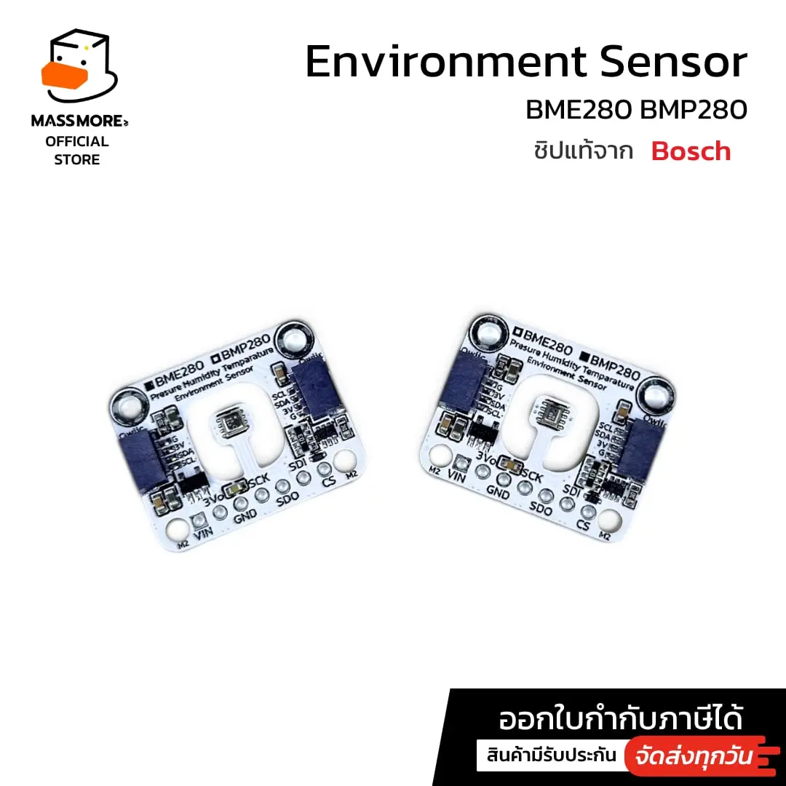
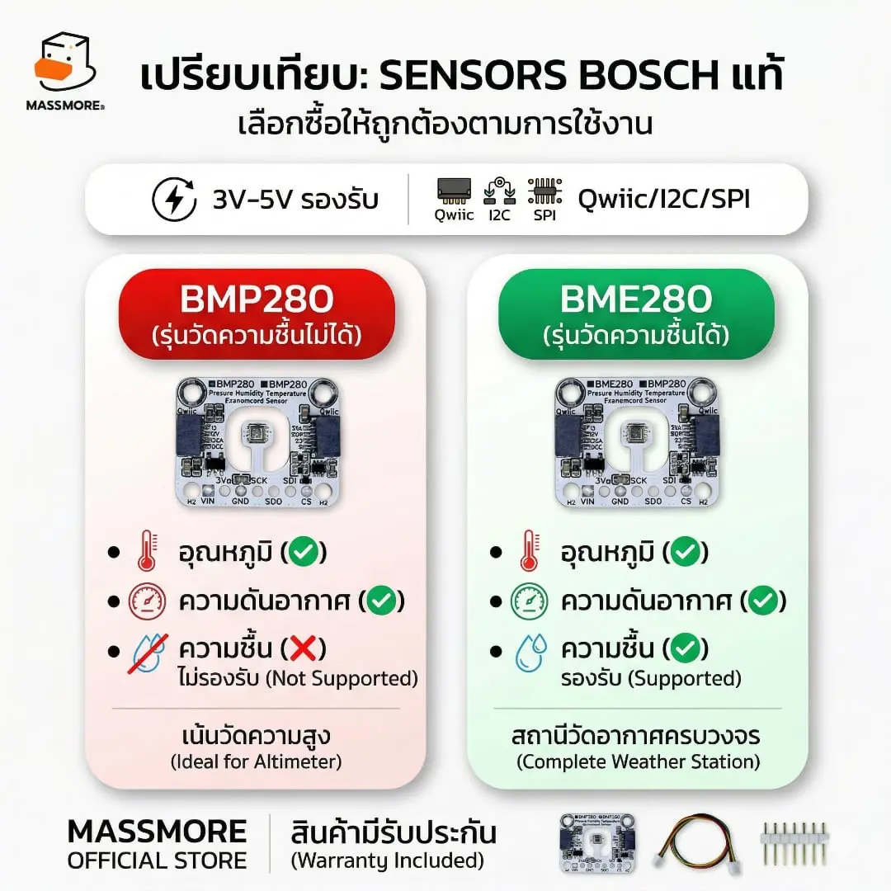
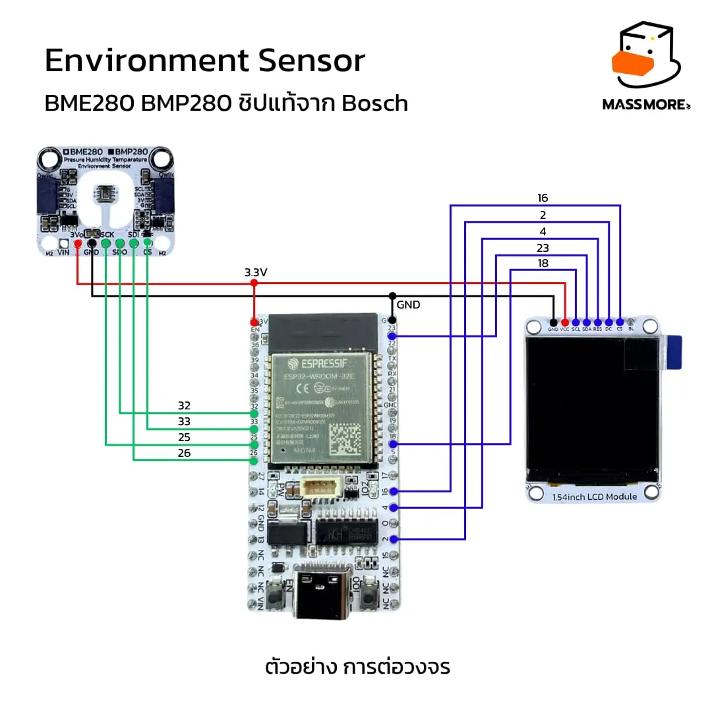
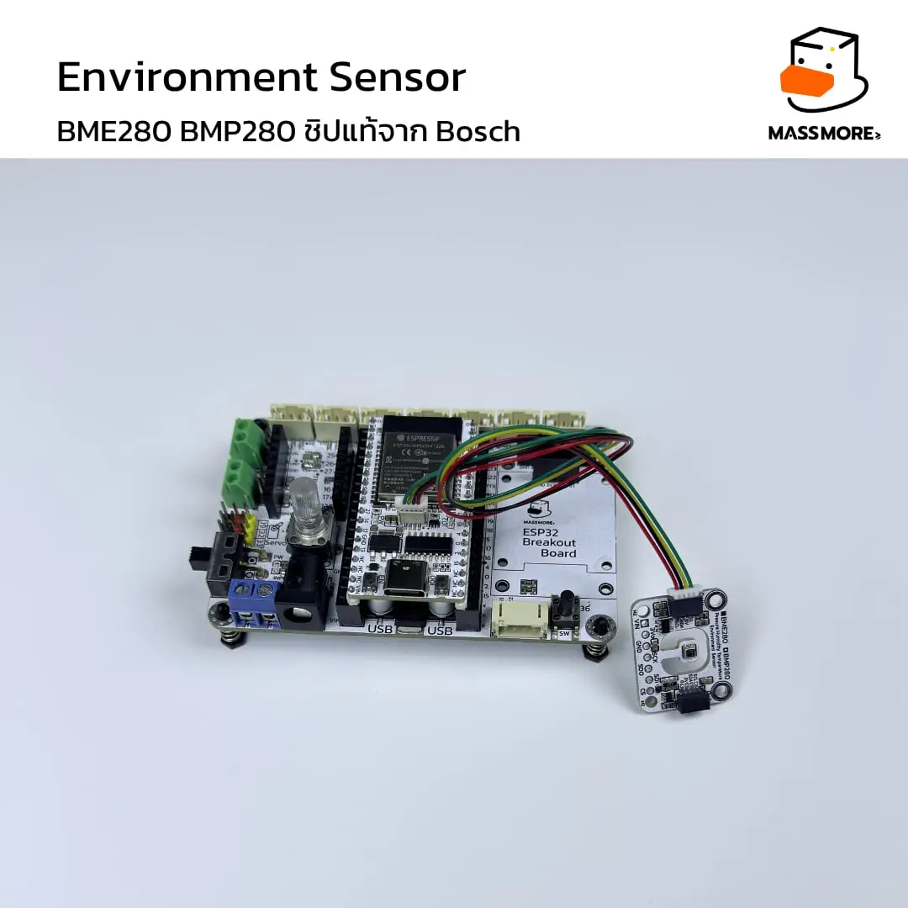

# Massmore BME280 — Environment Sensor (SKU-1023)

<p align="center">
  
</p>

<p align="center">
  <b>ไลบรารี Arduino / PlatformIO สำหรับเซ็นเซอร์ Bosch BME280</b><br>
  วัดอุณหภูมิ · ความชื้นสัมพัทธ์ · ความดันบรรยากาศ · คำนวณความสูง
</p>

<p align="center">
  
  
  
  
  
</p>

---

## สารบัญ

- [ทำไมต้องไลบรารีตัวนี้](#ทำไมต้องไลบรารีตัวนี้)
- [สเปกจากดาต้าชีต](#สเปกจากดาต้าชีต)
- [BME280 ต่างจาก BMP280 อย่างไร](#bme280-ต่างจาก-bmp280-อย่างไร)
- [หน้าตาบอร์ดและการต่อสาย](#หน้าตาบอร์ดและการต่อสาย)
- [ติดตั้ง](#ติดตั้ง)
- [เริ่มใช้ใน 10 บรรทัด](#เริ่มใช้ใน-10-บรรทัด)
- [คู่มือ API](#คู่มือ-api)
- [ชุดตั้งค่าสำเร็จรูปตามที่ Bosch แนะนำ](#ชุดตั้งค่าสำเร็จรูปตามที่-bosch-แนะนำ)
- [ตัวอย่างทั้งหมด](#ตัวอย่างทั้งหมด)
- [การตรวจว่าเป็นชิปของแท้](#การตรวจว่าเป็นชิปของแท้)
- [ชุดทดสอบโรงงาน](#ชุดทดสอบโรงงาน)
- [ชุดทดสอบบนเครื่อง PC](#ชุดทดสอบบนเครื่อง-pc)
- [แก้ปัญหาที่พบบ่อย](#แก้ปัญหาที่พบบ่อย)
- [โครงสร้างรีโป](#โครงสร้างรีโป)

---

## ทำไมต้องไลบรารีตัวนี้

| | รายละเอียด |
|---|---|
| **เขียนจากดาต้าชีตตรง ๆ** | สูตรชดเชยทุกบรรทัดคัดจาก Bosch **BST-BME280-DS002** หัวข้อ 4.2.3 ไม่ดัดแปลงลำดับการคำนวณ ผลลัพธ์ตรงกับตัวเลขตัวอย่างในดาต้าชีตทุกหลัก |
| **ไม่พึ่งไลบรารีอื่น** | ใช้แค่ `Wire` ไม่ต้องลง Adafruit_Sensor หรืออะไรเพิ่ม |
| **ไม่ใช้ heap** | ไม่มี `new` / `malloc` / `String` ในส่วนแกน เหมาะกับงานที่ต้องรันยาว ๆ ไม่ให้ memory fragment |
| **ครบทุกฟังก์ชันของชิป** | oversampling x1–x16 แยกรายช่อง, sleep/forced/normal, IIR filter, standby time, ค่าดิบ ADC, ค่าชดเชย 32 ตัว |
| **มีโหมดไม่บล็อก** | `startForcedMeasurement()` + `isMeasurementReady()` สำหรับงานที่ห้ามค้าง |
| **ตรวจชิปแท้ 10 ข้อ** | `verifyChip()` แยก **BMP280 (0x58)** ออกจาก **BME280 (0x60)** ได้ชัดเจน ไม่ได้ดูแค่ chip id แต่ทดสอบพฤติกรรมจริงของซิลิคอน |
| **คอมเมนต์ภาษาไทยทั้งหมด** | อ่านโค้ดแล้วเข้าใจว่าทำไมต้องเขียนแบบนั้น ไม่ใช่แค่ทำอะไร |
| **ทดสอบแล้ว 144 ข้อ** | ชุดทดสอบรันบนเครื่อง PC ได้เลย ไม่ต้องมีบอร์ด |

---

## สเปกจากดาต้าชีต

<p align="center">
  
</p>

### ความสามารถในการวัด

| ค่าที่วัด | ช่วง (Range) | ความละเอียด (Resolution) | ความแม่นยำ (Accuracy) |
|---|---|---|---|
| อุณหภูมิ | −40 ถึง +85 °C | 0.01 °C | ±0.5 °C (25 °C) · ±1.0 °C (0–65 °C) |
| ความชื้นสัมพัทธ์ | 0 ถึง 100 %RH | 0.008 %RH | ±3 %RH (20–80 %RH) |
| ความดันบรรยากาศ | 300 ถึง 1100 hPa | 0.18 Pa | ±1 hPa (สัมบูรณ์) · ±0.12 hPa (สัมพัทธ์) |
| ความสูง (คำนวณ) | 0 ถึง ~9000 m | ~0.17 m | ขึ้นกับการปรับเทียบระดับน้ำทะเล |

### ไฟฟ้าและอินเทอร์เฟซ

| หัวข้อ | ค่า |
|---|---|
| แรงดันที่บอร์ดรับได้ | 3–5 V (มีเรกูเลเตอร์บนบอร์ด) |
| แรงดันชิป (VDD) | 1.71–3.6 V |
| กระแสตอน sleep | 0.1 µA |
| กระแสตอนวัด (x1 ทุกช่อง, 1 Hz) | ~3.6 µA |
| กระแสตอนวัดต่อเนื่อง (normal, x16) | ~340 µA |
| อินเทอร์เฟซ | I²C (มาตรฐาน 100 kHz / เร็ว 400 kHz) และ SPI |
| ที่อยู่ I²C | `0x76` (SDO ลง GND, ค่าปริยาย) · `0x77` (บัดกรีจัมเปอร์ ADDR) |
| หัวต่อ | Qwiic / STEMMA QT สองหัว (ต่อพ่วงได้) + แพดบัดกรี |
| ขนาดบอร์ด | 25.40 × 20.32 mm · รูยึด M2 |

### เวลาที่ใช้วัดต่อหนึ่งรอบ (ดาต้าชีตหัวข้อ 9.1)

| oversampling (T/P/H) | ค่าทั่วไป | กรณีแย่ที่สุด |
|---|---|---|
| x1 / x1 / x1 | 8 ms | 10 ms |
| x2 / x2 / x2 | 14 ms | 17 ms |
| x2 / x16 / x1 | 40 ms | 46 ms |
| x16 / x16 / x16 | 98 ms | 113 ms |

ไลบรารีคำนวณค่าเหล่านี้ให้อัตโนมัติผ่าน `measurementTimeMs()` และ `measurementTimeMaxMs()`
จึงไม่ต้องเดาว่าต้อง `delay()` เท่าไร

---

## BME280 ต่างจาก BMP280 อย่างไร

<p align="center">
  
</p>

สองรุ่นนี้ใช้แพ็กเกจเดียวกัน หน้าตาบอร์ดเหมือนกันเป๊ะ ต่างกันแค่รหัสในรีจิสเตอร์ `0xD0`

| | BME280 | BMP280 |
|---|---|---|
| Chip ID (0xD0) | **`0x60`** | **`0x58`** |
| อุณหภูมิ | ✅ | ✅ |
| ความดัน | ✅ | ✅ |
| **ความชื้น** | ✅ | ❌ **ไม่มี** |
| รีจิสเตอร์ `ctrl_hum` (0xF2) | มี | ไม่มี |
| ค่าชดเชย dig_H1–H6 | มี | ไม่มี |
| เหมาะกับ | สถานีวัดอากาศครบวงจร | วัดความสูง / บารอมิเตอร์ |

> **ไลบรารีนี้ใช้กับ BME280 เท่านั้น**
> ถ้าเสียบบอร์ด BMP280 เข้าไป `begin()` จะไม่ผ่านและรายงานว่า
> `รหัสชิปไม่ใช่ 0x60 อาจเป็น BMP280 หรือของเลียนแบบ`
> ให้ตรวจช่องติ๊กบนซิลค์สกรีนของบอร์ดว่าติ๊กรุ่นไหนไว้

---

## หน้าตาบอร์ดและการต่อสาย

### ตำแหน่งขาและขนาด

<p align="center">
  
</p>

| ขา | หน้าที่ | ต่อกับ ESP32 |
|---|---|---|
| `VIN` | ไฟเข้า 3–5 V | `3V3` หรือ `5V` |
| `3Vo` | ไฟ 3.3 V ที่ออกจากเรกูเลเตอร์ | ไม่ต้องต่อ (จ่ายให้อุปกรณ์อื่นได้) |
| `GND` | กราวด์ | `GND` |
| `SCK` | I²C **SCL** / SPI SCK | `GPIO 22` |
| `SDI` | I²C **SDA** / SPI MOSI | `GPIO 21` |
| `SDO` | เลือก address / SPI MISO | ไม่ต้องต่อ (ลง GND ในตัวอยู่แล้ว = 0x76) |
| `CS` | Chip Select ของ SPI | ไม่ต้องต่อเมื่อใช้ I²C |

### ต่อกับ ESP32

<p align="center">
  
</p>

วิธีที่ง่ายที่สุดคือ **เสียบสาย Qwiic เส้นเดียว** ไม่ต้องต่อสายเปล่าเลย

<p align="center">
  
</p>

```
ESP32 ────── Qwiic ────── Massmore BME280
                          SDA = GPIO 21
                          SCL = GPIO 22
                          addr = 0x76
```

> **ต้องการเซ็นเซอร์สองตัวบนบัสเดียวกัน?**
> บัดกรีจัมเปอร์ `ADDR` ด้านหลังบอร์ดตัวที่สอง เพื่อย้ายไป `0x77`
> แล้วต่อพ่วงผ่านหัว Qwiic อีกหัวได้เลย (ดูตัวอย่าง `09_MultipleSensors`)

---

## ติดตั้ง

### Arduino IDE

รีโปนี้มีไฟล์ **`ArduinoIDE/Massmore_BME280.zip`** เตรียมไว้ให้แล้ว ติดตั้งได้ทันที

1. ดาวน์โหลดรีโปนี้เป็น ZIP หรือ `git clone`
2. Arduino IDE → **Sketch → Include Library → Add .ZIP Library…**
3. เลือกไฟล์ **`ArduinoIDE/Massmore_BME280.zip`**
4. เปิดตัวอย่างที่ **File → Examples → Massmore_BME280**

หรือคัดลอกโฟลเดอร์ `ArduinoIDE/Massmore_BME280` ไปวางที่ `~/Documents/Arduino/libraries/` ตรง ๆ ก็ได้

> แก้โค้ดแล้วอยากอัปเดตไฟล์ ZIP ให้รัน `ArduinoIDE/make_zip.sh`
> รายละเอียดเพิ่มเติมและวิธีแก้ปัญหาตอน import อยู่ที่ [`ArduinoIDE/README.md`](ArduinoIDE/README.md)

**สิ่งที่ต้องมีก่อน** — ESP32 board package **core 3.x**
ใส่ URL นี้ใน Preferences → Additional Boards Manager URLs

```
https://espressif.github.io/arduino-esp32/package_esp32_index.json
```

### VS Code + PlatformIO

```bash
git clone https://github.com/Massmore/Massmore_BME280_SKU-1023.git
code Massmore_BME280_SKU-1023/PlatformIO
```

ไลบรารีอยู่ใน `lib/Massmore_BME280/` แล้ว PlatformIO หาเจอเอง ไม่ต้องตั้งค่าเพิ่ม

```bash
cp examples/01_BasicReading/main.cpp src/main.cpp
pio run -t upload -t monitor
```

`platformio.ini` pin ไว้ที่ **pioarduino 55.03.311 = Arduino ESP32 core 3.3.11 (ฐาน ESP-IDF v5.x)**
เพื่อให้ผลการ build ซ้ำได้เหมือนเดิมทุกครั้ง

---

## เริ่มใช้ใน 10 บรรทัด

```cpp
#include <Massmore_BME280.h>
#include <Wire.h>

MassmoreBME280 bme;

void setup() {
  Serial.begin(115200);
  Wire.begin(21, 22);   // Qwiic ของบอร์ด Massmore
  bme.begin();          // ปริยาย 0x76 พร้อมตรวจ chip id ให้ด้วย
}

void loop() {
  massmore_bme280_reading_t r;
  if (bme.read(r)) {
    Serial.printf("%.2f C  %.2f %%RH  %.2f hPa  %.1f m\n",
                  r.temperature, r.humidity, r.pressure, r.altitude);
  }
  delay(2000);
}
```

> **ทำไมควรใช้ `read()` แทนการเรียกทีละค่า**
> `read()` อ่านรีจิสเตอร์ `0xF7–0xFE` รวดเดียว 8 ไบต์ จึงได้ทั้งสามค่าจาก **รอบวัดเดียวกัน**
> ถ้าเรียก `readTemperature()` / `readPressure()` / `readHumidity()` แยกกัน
> จะเสียเวลาบัสสามเท่าและได้ค่าจากคนละรอบวัด

---

## คู่มือ API

### กลุ่มพื้นฐาน

| ฟังก์ชัน | คืนค่า | คำอธิบาย |
|---|---|---|
| `begin(address, wire)` | `bool` | เริ่มต้น ตรวจ chip id, รีเซ็ต, อ่านค่าชดเชย และตั้งค่าเริ่มต้นให้ |
| `beginAuto(wire)` | `bool` | เหมือน `begin()` แต่ไล่หาเองทั้ง 0x76 และ 0x77 |
| `read(reading)` | `bool` | อ่านทุกค่าในครั้งเดียว **(แนะนำ)** |
| `readTemperature()` | `float` | องศาเซลเซียส |
| `readPressure()` | `float` | เฮกโตปาสคาล (hPa = mbar) |
| `readPressurePa()` | `float` | ปาสคาล |
| `readHumidity()` | `float` | เปอร์เซ็นต์ความชื้นสัมพัทธ์ |
| `readAltitude(seaLevelhPa)` | `float` | เมตร |

โครงสร้าง `massmore_bme280_reading_t`

```cpp
float    temperature;  // องศาเซลเซียส
float    pressure;     // hPa
float    humidity;     // %RH
float    altitude;     // เมตร
uint32_t timestamp;    // millis() ตอนอ่านสำเร็จ
bool     valid;        // ข้อมูลชุดนี้ใช้ได้หรือไม่
```

### กลุ่มตั้งค่าขั้นสูง

| ฟังก์ชัน | คำอธิบาย |
|---|---|
| `setSampling(mode, osrsT, osrsP, osrsH, filter, standby)` | ตั้งทั้งชุดในครั้งเดียว เรียงลำดับการเขียนรีจิสเตอร์ให้ถูกต้องตามดาต้าชีตให้แล้ว |
| `setMode(mode)` | เปลี่ยนโหมดอย่างเดียว |
| `setTemperatureOversampling(s)` / `setPressureOversampling(s)` / `setHumidityOversampling(s)` | ตั้ง oversampling ทีละช่อง |
| `setFilter(filter)` | ค่าสัมประสิทธิ์ฟิลเตอร์ IIR |
| `setStandbyTime(standby)` | เวลาพักระหว่างรอบ (โหมด normal) |
| `takeForcedMeasurement()` | สั่งวัดหนึ่งครั้งแล้วรอจนเสร็จ (บล็อก) |
| `startForcedMeasurement()` | สั่งวัดแล้วคืนค่าทันที (ไม่บล็อก) |
| `isMeasurementReady()` | ถามว่าผลพร้อมหรือยัง (ไม่บล็อก) |
| `isMeasuring()` / `isUpdatingNVM()` | อ่านบิตในรีจิสเตอร์ status |
| `reset()` | soft reset แล้วเขียนค่าที่ตั้งไว้กลับให้เอง |
| `measurementTimeMs()` / `measurementTimeMaxMs()` | เวลาที่ต้องใช้ต่อรอบตามค่าที่ตั้งไว้ |

### ค่าที่ตั้งได้

| enum | ค่าที่เลือกได้ |
|---|---|
| `massmore_bme280_sampling_t` | `NONE` (ปิดช่อง) · `X1` · `X2` · `X4` · `X8` · `X16` |
| `massmore_bme280_mode_t` | `SLEEP` · `FORCED` · `NORMAL` |
| `massmore_bme280_filter_t` | `OFF` · `2` · `4` · `8` · `16` |
| `massmore_bme280_standby_t` | `0_5_MS` · `10_MS` · `20_MS` · `62_5_MS` · `125_MS` · `250_MS` · `500_MS` · `1000_MS` |

### กลุ่มข้อมูลดิบ

| ฟังก์ชัน | คำอธิบาย |
|---|---|
| `readRawADC(raw)` | ค่าดิบทั้งสามช่อง พร้อม `t_fine` |
| `getCalibration(calib)` | ค่าชดเชยจากโรงงานทั้ง 32 ตัว |
| `readCalibration()` | อ่านค่าชดเชยจากชิปใหม่ |
| `readRegister(reg, value)` / `writeRegister(reg, value)` | อ่าน/เขียนรีจิสเตอร์ใดก็ได้ |
| `compensateTemperature(adc_T)` | สูตรชดเชยอุณหภูมิ คืนหน่วย 0.01 °C |
| `compensatePressure(adc_P)` | สูตรชดเชยความดัน คืนรูป Q24.8 (Pa) |
| `compensateHumidity(adc_H)` | สูตรชดเชยความชื้น คืนรูป Q22.10 (%RH) |

### กลุ่มค่าที่คำนวณต่อ (เรียกแบบ static ได้เลย)

| ฟังก์ชัน | คำอธิบาย |
|---|---|
| `MassmoreBME280::dewPoint(t, rh)` | จุดน้ำค้าง (Magnus-Tetens) องศาเซลเซียส |
| `MassmoreBME280::absoluteHumidity(t, rh)` | ความชื้นสัมบูรณ์ g/m³ |
| `MassmoreBME280::saturationVaporPressure(t)` | ความดันไออิ่มตัว hPa |
| `MassmoreBME280::seaLevelForAltitude(alt, p)` | ความดันระดับน้ำทะเล เมื่อรู้ความสูงจริง |

### กลุ่มค่าชดเชยที่ตั้งเอง

```cpp
bme.setTemperatureOffset(-1.5f);  // บอร์ดติดใกล้ ESP32 ที่ร้อน จึงหักออก 1.5 องศา
bme.setHumidityOffset(0.0f);
bme.setPressureOffset(0.0f);
bme.setSeaLevelPressure(1008.4f); // ค่าจริงของพื้นที่ในวันนั้น
```

### กลุ่มข้อผิดพลาด

```cpp
if (!bme.read(reading)) {
  Serial.println(MassmoreBME280::errorToString(bme.lastError()));
}
```

| รหัส | ความหมาย |
|---|---|
| `MASSMORE_BME280_OK` | สำเร็จ |
| `..._ERR_NOT_BEGUN` | ยังไม่ได้เรียก `begin()` |
| `..._ERR_NO_DEVICE` | ไม่มีอุปกรณ์ตอบที่ address นี้ |
| `..._ERR_I2C_WRITE` / `..._ERR_I2C_READ` | สื่อสารบนบัสไม่สำเร็จ |
| `..._ERR_WRONG_CHIP` | รหัสชิปไม่ใช่ 0x60 (อาจเป็น BMP280) |
| `..._ERR_TIMEOUT` | รอผลวัดเกินเวลา |
| `..._ERR_WRONG_MODE` | โหมดหรือ oversampling ไม่เหมาะกับสิ่งที่สั่ง |
| `..._ERR_BAD_ARG` | พารามิเตอร์ไม่ถูกต้อง |
| `..._ERR_CALIB` | ค่าชดเชยจากโรงงานผิดปกติ |
| `..._ERR_NO_HUMIDITY` | ชิปตัวนี้ไม่มีเซ็นเซอร์ความชื้น |

---

## ชุดตั้งค่าสำเร็จรูปตามที่ Bosch แนะนำ

ดาต้าชีตหัวข้อ 3.5 มีชุดตั้งค่าที่ Bosch ทดสอบมาแล้วสำหรับงานสี่แบบ
ไลบรารีทำเป็นฟังก์ชันเดียวจบให้แล้ว

| ฟังก์ชัน | โหมด | osrs T / P / H | ฟิลเตอร์ | เหมาะกับ |
|---|---|---|---|---|
| `useWeatherStationPreset()` | forced | x1 / x1 / x1 | ปิด | สถานีวัดอากาศ วัดนาทีละครั้ง กินไฟต่ำสุด |
| `useHumiditySensingPreset()` | forced | x1 / ปิด / x1 | ปิด | วัดความชื้นในบ้าน ปิดช่องความดันเพื่อประหยัดไฟ |
| `useIndoorNavigationPreset()` | normal | x2 / x16 / x1 | 16 | วัดความสูงในอาคาร noise ต่ำสุด |
| `useGamingPreset()` | normal | x1 / x4 / ปิด | 16 | วัดความสูงตอบสนองไว ไม่ต้องใช้ความชื้น |

---

## ตัวอย่างทั้งหมด

ตัวอย่างทุกชุดใช้ซอร์สเดียวกันทั้งฝั่ง Arduino IDE (`.ino`) และ PlatformIO (`main.cpp`)
และ **ไม่มี dependency ภายนอกเลย** (ไม่ต้องมี WiFi, OLED หรือ SD card)

| # | ตัวอย่าง | สิ่งที่ได้เรียนรู้ |
|---|---|---|
| 01 | **BasicReading** | อ่านครบสี่ค่า พร้อมจุดน้ำค้าง เริ่มจากตรงนี้ |
| 02 | **Oversampling** | วัดจริง 32 ครั้งต่อระดับ แล้วเทียบ noise กับเวลาที่ใช้ของ x1 ถึง x16 |
| 03 | **ForcedMode_LowPower** | forced mode + ESP32 deep sleep เก็บค่ารอบก่อนใน RTC memory เตือนแนวโน้มความดัน |
| 04 | **IIR_Filter_Standby** | เทียบ noise ของฟิลเตอร์ทั้งห้าระดับด้วยตัวเลขจริง และตารางเวลาพัก |
| 05 | **Altitude_SeaLevel** | ปรับเทียบระดับน้ำทะเลผ่าน Serial ให้วัดความสูงได้แม่นระดับเมตร |
| 06 | **RawData_Calibration** | เปิดฝาดูข้างในชิป ค่าดิบ ADC, `t_fine` และค่าชดเชยทั้ง 32 ตัว |
| 07 | **ChipID_Genuine** | สแกนบัส, อ่าน chip id, ตรวจของแท้ 10 ข้อ, พิมพ์ลายนิ้วมือของชิป |
| 08 | **NonBlocking** | เครื่องสถานะที่ไม่ค้างเลย พร้อมตัวเลขพิสูจน์ว่า `loop()` เร็วแค่ไหน |
| 09 | **MultipleSensors** | สองตัวบนบัสเดียว (0x76 + 0x77) เทียบผลต่างและคำนวณต่างระดับความสูง |
| 10 | **FactoryTest** | ชุดทดสอบโรงงาน 22 หัวข้อ พร้อมบรรทัด `#RESULT` ให้เว็บอ่าน |

---

## การตรวจว่าเป็นชิปของแท้

```cpp
massmore_bme280_identity_t id;
massmore_bme280_genuine_t verdict = bme.verifyChip(&id);

Serial.print(MassmoreBME280::genuineToString(verdict));  // ของแท้ / น่าสงสัย / ไม่ผ่าน
Serial.println(id.passCount);                            // ผ่านกี่ข้อจาก 10
```

การดูแค่ chip id ไม่พอ เพราะของปลอมคัดลอกตัวเลขเดียวได้ง่าย
`verifyChip()` จึงทดสอบ **พฤติกรรมจริงของซิลิคอน** ด้วย

| # | ข้อทดสอบ | ทำไมของปลอมถึงตกข้อนี้ |
|---|---|---|
| 1 | `chipIdOk` | รหัสที่ 0xD0 ต้องเป็น 0x60 |
| 2 | `calibTempOk` | ช่วงค่า `dig_T1..T3` ที่โรงงาน Bosch ใช้จริงแคบกว่าที่คนนอกเดา |
| 3 | `calibPressOk` | เช่นเดียวกันกับ `dig_P1..P9` |
| 4 | `calibHumOk` | **BMP280 ที่ถูกสกรีนเป็น BME280 ไม่มีค่าชุดนี้เลย** |
| 5 | `calibUniqueOk` | ค่าชดเชยของชิปจริงไม่มีทางซ้ำกันหมดแบบตารางที่ใครใส่ไว้ |
| 6 | `resetOk` | soft reset ต้องล้าง `ctrl_meas` / `ctrl_hum` / `config` กลับเป็น 0x00 จริง |
| 7 | `ctrlHumLatchOk` | ปิด `osrs_h` แล้วค่าดิบต้องเป็น `0x8000` เปิดแล้วต้องไม่ใช่ — **ลักษณะเฉพาะของ BME280** |
| 8 | `registerEchoOk` | เขียน `config` แล้วอ่านกลับต้องได้ครบทุกบิต |
| 9 | `measuringBitOk` | บิต measuring ต้องขึ้นระหว่างวัดและลงเองเมื่อเสร็จ ตามเวลาจริง |
| 10 | `humidityLiveOk` | ค่าความชื้นที่คำนวณออกมาต้องอยู่ในโลกความจริง ไม่ใช่ค่าคงที่ |

**เกณฑ์สรุป** — ผ่านครบ 10 = `ของแท้` · ผ่าน 8–9 = `น่าสงสัย` · ต่ำกว่า 8 หรือตกข้อ 1 หรือ 7 = `ไม่ผ่าน`

> **ลายนิ้วมือของชิป**
> ค่าชดเชย 32 ตัวไม่ซ้ำกันเลยระหว่างชิปสองตัว
> ถ้าเจอบอร์ดสองแผ่นที่ `dig_T1` / `dig_P1` / `dig_H1` ตรงกันเป๊ะ
> แปลว่าอย่างน้อยแผ่นหนึ่งไม่ใช่ของแท้

---

## ชุดทดสอบโรงงาน

ตัวอย่าง `10_FactoryTest` เป็นชุดตรวจบอร์ดแบบเต็ม รันเองทันทีหลังบูต พิมพ์ `r` เพื่อทดสอบซ้ำ

```
GATE 1  สแกนบัส I2C หา 0x76 หรือ 0x77
GATE 2  ตรวจรหัสประจำรุ่นว่าเป็น 0x60 (ถ้าเจอ 0x58 จะบอกชัดว่าเป็น BMP280)
RUN TEST  ทดสอบต่ออีก 22 หัวข้อ
```

| หัวข้อ | ตรวจอะไร |
|---|---|
| `I2C_SCAN` · `CHIP_ID` · `BEGIN` | ด่านคัดกรอง ถ้าไม่ผ่านจะหยุดทันที |
| `SOFT_RESET` | รีเซ็ตแล้วรีจิสเตอร์กลับเป็นค่าโรงงานจริง |
| `CALIB_READ` · `CALIB_RANGE` · `CALIB_HUM` | ค่าชดเชยครบและอยู่ในช่วงที่ Bosch ใช้ |
| `REG_ECHO` · `STATUS_REG` | เขียนอ่านรีจิสเตอร์ตรงกัน บิตสงวนเป็นศูนย์ |
| `SLEEP_MODE` · `FORCED_MODE` · `NORMAL_MODE` | ทั้งสามโหมดทำงานถูกต้อง |
| `HUM_CHANNEL` | ช่องความชื้นเปิดปิดตาม `osrs_h` ได้จริง |
| `MEAS_TIMING` | เวลาที่ใช้วัดจริงสอดคล้องกับสูตรในดาต้าชีต |
| `NOISE` · `IIR_FILTER` | วัด noise จริงและตรวจว่าฟิลเตอร์ช่วยจริง |
| `READ_VALUES` · `TEMP_RANGE` · `HUM_RANGE` · `PRES_RANGE` | ค่าที่วัดได้อยู่ในช่วงที่เป็นไปได้ |
| `DEWPOINT` · `ALTITUDE` | ค่าที่คำนวณต่อสอดคล้องกัน |
| `STABILITY` · `BUS_400K` · `PRESETS` · `GENUINE` | ความนิ่ง ความเร็วบัสสูง ชุดสำเร็จรูป และการตรวจของแท้ |

### รูปแบบบรรทัดที่ให้เว็บอ่าน

```
#RESULT,<ลำดับ>,<ชื่อหัวข้อ>,<PASS|FAIL|WARN>,<รายละเอียด>
#DEVICE,<addr>,<chip>,<chip_id>,<GENUINE|SUSPECT|FAKE|UNKNOWN>,<ผ่านกี่ข้อจาก10>
#VERDICT,<PASS|FAIL>,<ผ่าน>,<ไม่ผ่าน>,<เตือน>
```

ตัวอย่างผลจริง

```
[ OK ] 01 I2C_SCAN       พบเซ็นเซอร์ที่ 0x76 (อุปกรณ์บนบัสทั้งหมด 1 ตัว)
#RESULT,1,I2C_SCAN,PASS,พบเซ็นเซอร์ที่ 0x76 (อุปกรณ์บนบัสทั้งหมด 1 ตัว)
...
#DEVICE,0x76,BME280,0x60,GENUINE,10
#VERDICT,PASS,22,0,0
```

### เฟิร์มแวร์สำเร็จรูป

ในโฟลเดอร์ [`firmware/`](firmware/) มีไฟล์ `.bin` ที่บิลด์ไว้แล้วสำหรับบอร์ด `esp32dev`
แฟลชได้เลยโดยไม่ต้องคอมไพล์เอง ดูขั้นตอนที่ [`firmware/README.md`](firmware/README.md)

---

## ชุดทดสอบบนเครื่อง PC

ไม่ต้องมีบอร์ด ไม่ต้องมี PlatformIO ใช้แค่ `g++`

```bash
cd PlatformIO/test
make
```

```
  ผ่าน 144 ข้อ   ไม่ผ่าน 0 ข้อ   รวม 144 ข้อ
```

ชุดทดสอบครอบคลุม

- **สูตรชดเชยเทียบกับตัวเลขตัวอย่างในดาต้าชีต** — `adc_T = 519888` ต้องได้ `t_fine = 128422`
  และ `T = 2508` (25.08 °C) · `adc_P = 415148` ต้องได้ 100653.27 Pa
- การถอดค่าชดเชย โดยเฉพาะ `dig_H4` / `dig_H5` ที่ใช้ไบต์ `0xE5` ร่วมกันคนละครึ่ง
- **ลำดับการเขียนรีจิสเตอร์** — `config` → `ctrl_hum` → `ctrl_meas`
- สูตรเวลาที่ใช้วัดทั้งค่าทั่วไปและกรณีแย่ที่สุด
- เส้นทางที่ผิดพลาดทุกทาง (ไม่มีอุปกรณ์, address ผิด, เจอ BMP280, ยังไม่ `begin()`)
- การแยก BME280 ออกจาก BMP280 และการจับค่าชดเชยปลอม

---

## แก้ปัญหาที่พบบ่อย

| อาการ | สาเหตุที่พบบ่อยที่สุด | วิธีแก้ |
|---|---|---|
| `begin()` ไม่ผ่าน · `ไม่มีอุปกรณ์ตอบ` | สาย Qwiic ไม่แน่น หรือ SDA/SCL สลับข้าง | ตรวจ `VIN` `GND` `SDA→21` `SCL→22` แล้วรัน `07_ChipID_Genuine` เพื่อสแกนบัส |
| สแกนเจอ `0x77` แทน `0x76` | จัมเปอร์ `ADDR` ถูกบัดกรีไว้ | เรียก `bme.begin(MASSMORE_BME280_I2C_ADDR_B)` หรือใช้ `beginAuto()` |
| `รหัสชิปไม่ใช่ 0x60` | บอร์ดตัวนี้เป็น **BMP280** ซึ่งไม่มีเซ็นเซอร์ความชื้น | ตรวจช่องติ๊กบนซิลค์สกรีน · BMP280 ใช้ไลบรารีนี้ไม่ได้ |
| ความชื้นเป็น `NAN` | `osrs_h` ถูกตั้งเป็น `SAMPLING_NONE` | ตั้ง `setHumidityOversampling(MASSMORE_BME280_SAMPLING_X1)` |
| อุณหภูมิสูงกว่าความจริง 1–3 °C | ความร้อนจาก ESP32 นำผ่านบอร์ดมา | ต่อสาย Qwiic ให้ยาวขึ้นเพื่อแยกบอร์ดออกห่าง หรือใช้ `setTemperatureOffset(-1.5f)` |
| ความสูงเพี้ยนหลายสิบเมตร | ใช้ระดับน้ำทะเลมาตรฐาน 1013.25 ซึ่งไม่ตรงกับวันนั้น | ปรับเทียบด้วย `05_Altitude_SeaLevel` |
| ค่าแกว่งมาก | ปิดฟิลเตอร์ไว้ หรือ oversampling ต่ำเกิน | เปิด `FILTER_16` และเพิ่ม oversampling (ดู `02` และ `04`) |
| ค่าแรกหลังเปิดฟิลเตอร์เพี้ยน | ฟิลเตอร์ IIR ต้องการหลายรอบกว่าจะเข้าที่ | ทิ้งค่าแรก ๆ ราว 20–40 รอบ หรือปิดฟิลเตอร์เมื่อใช้ forced mode นาน ๆ ครั้ง |
| อัปโหลดไม่ผ่านบน macOS | `upload_speed` สูงเกินไป | ลดเป็น `460800` หรือ `115200` ใน `platformio.ini` |

---

## โครงสร้างรีโป

```
Massmore_BME280_SKU-1023/
├── ArduinoIDE/
│   ├── README.md                          วิธีติดตั้งสำหรับ Arduino IDE
│   ├── Massmore_BME280.zip                <- ไฟล์พร้อม Add .ZIP Library
│   ├── make_zip.sh                        สคริปต์สร้าง ZIP ใหม่หลังแก้โค้ด
│   └── Massmore_BME280/                   ซอร์สจริงของไลบรารี
│       ├── library.properties
│       ├── keywords.txt
│       ├── CHANGELOG.md
│       ├── LICENSE
│       ├── src/
│       │   ├── Massmore_BME280.h
│       │   ├── Massmore_BME280.cpp
│       │   └── Massmore_BME280_Registers.h
│       └── examples/                      ตัวอย่าง 10 ชุด (.ino)
├── PlatformIO/
│   ├── README.md
│   ├── platformio.ini                     pin ESP32 core 3.3.11
│   ├── src/main.cpp                       ที่วางตัวอย่างที่กำลังใช้
│   ├── lib/Massmore_BME280/               ซอร์สชุดเดียวกับฝั่ง Arduino IDE
│   ├── examples/                          ตัวอย่าง 10 ชุด (main.cpp)
│   └── test/                              ชุดทดสอบบนเครื่อง PC 144 ข้อ
├── firmware/
│   ├── README.md                          คู่มือแฟลชเฟิร์มแวร์
│   └── esp32dev/                          .bin สำเร็จรูปของ Factory Test
├── docs/images/                           รูปสินค้า ผังขา และการต่อสาย
├── .github/workflows/build.yml            CI: host test + คอมไพล์ทุกตัวอย่าง
├── LICENSE
└── README.md
```

---

## เอกสารอ้างอิง

- Bosch Sensortec **BST-BME280-DS002** — BME280 Combined humidity and pressure sensor datasheet
- Espressif **Arduino ESP32 core 3.x** — https://github.com/espressif/arduino-esp32
- **pioarduino** platform-espressif32 — https://github.com/pioarduino/platform-espressif32

## สัญญาอนุญาต

MIT License — ดูรายละเอียดที่ [LICENSE](LICENSE)

---

<p align="center">
  <b>by Massmore</b> · <a href="https://www.massmore.shop">massmore.shop</a><br>
  <sub>Massmore Biz Co., Ltd. — สินค้ามีรับประกัน ออกใบกำกับภาษีได้ จัดส่งทุกวัน</sub>
</p>
