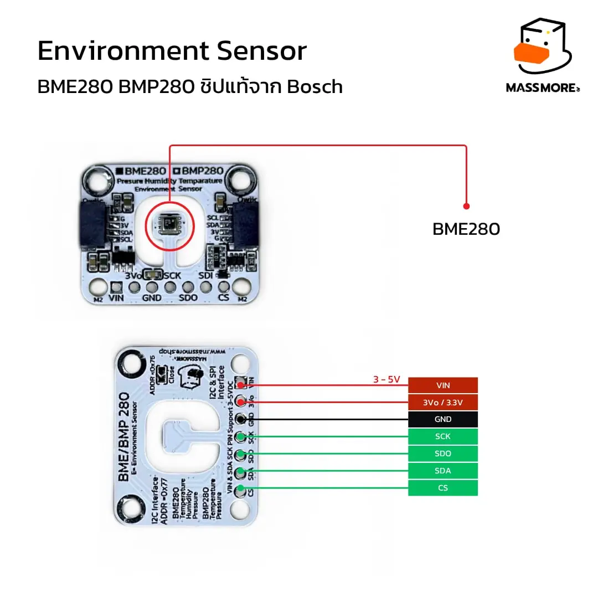
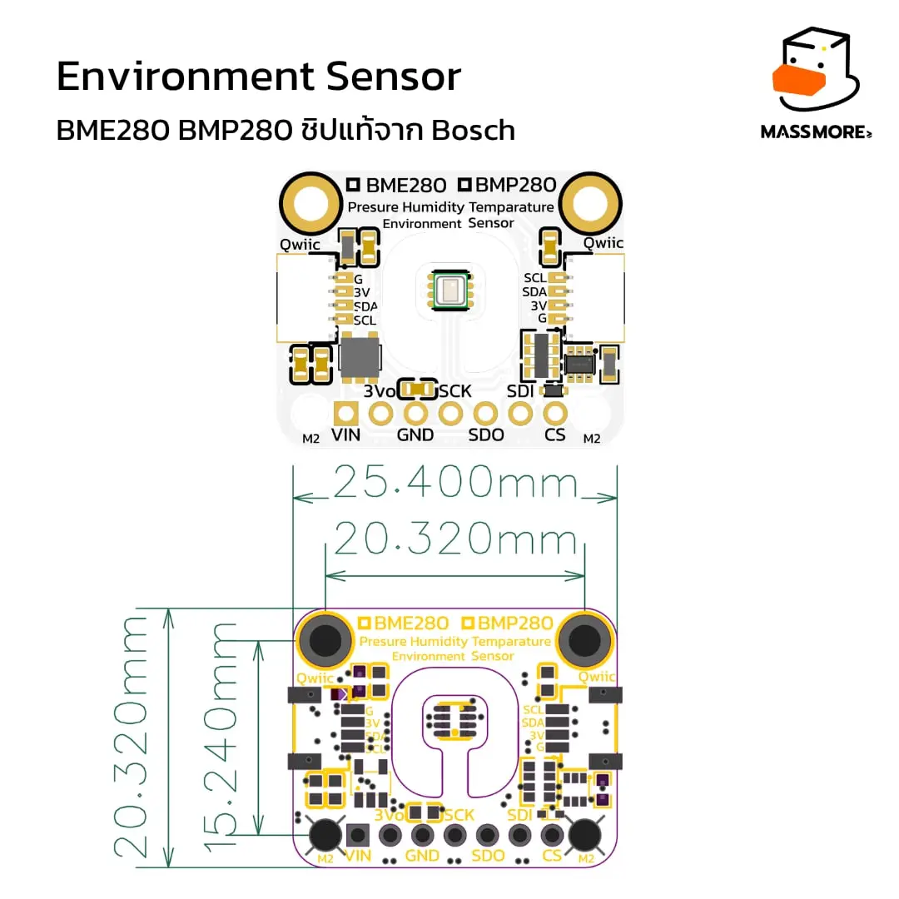

# Massmore BME280 — Environment Sensor (SKU-1023)

<p align="center">
  
</p>

<p align="center">
  <b>ไลบรารี Arduino / PlatformIO สำหรับเซ็นเซอร์ Bosch BME280 (I²C + SPI)</b><br>
  วัดอุณหภูมิ · ความชื้นสัมพัทธ์ · ความดันบรรยากาศ · คำนวณความสูง<br>
  <sub><b>Designed and Manufactured by Massmore</b> · Massmore Biz Co., Ltd.</sub>
</p>

<p align="center">
  
  
  
  
  
  
</p>

---

## สารบัญ

- [ภาพรวมผลิตภัณฑ์](#ภาพรวมผลิตภัณฑ์)
- [Pre-flight Datasheet Verification](#pre-flight-datasheet-verification)
- [MCU Compatibility & Limitation Matrix](#mcu-compatibility--limitation-matrix)
- [Pinout และการต่อสาย](#pinout-และการต่อสาย)
- [Where to Buy](#where-to-buy)
- [ติดตั้ง](#ติดตั้ง)
- [Quick Start](#quick-start)
- [Pin Mapping Examples](#pin-mapping-examples)
- [คู่มือ API](#คู่มือ-api)
- [ตัวอย่างทั้งหมด (7 ชุด)](#ตัวอย่างทั้งหมด-7-ชุด)
- [การตรวจว่าเป็นชิปของแท้](#การตรวจว่าเป็นชิปของแท้)
- [Factory Test (QA/QC)](#factory-test-qaqc)
- [ชุดทดสอบบนเครื่อง PC](#ชุดทดสอบบนเครื่อง-pc)
- [แก้ปัญหาที่พบบ่อย](#แก้ปัญหาที่พบบ่อย)
- [โครงสร้างรีโป](#โครงสร้างรีโป)
- [Massmore Pre-Release Audit & Missing Information Report](#massmore-pre-release-audit--missing-information-report)

---

## ภาพรวมผลิตภัณฑ์

<p align="center">
  
</p>

บอร์ด **Massmore BME280 (SKU-1023)** คือโมดูลเซ็นเซอร์สภาพแวดล้อม Bosch BME280 ที่มีเรกูเลเตอร์
และ level shifting ในตัว รับไฟ 3–5 V ต่อได้ทั้ง **I²C (Qwiic / STEMMA QT)** และ **SPI 4 สาย**

| | รายละเอียด |
|---|---|
| **เขียนจากดาต้าชีตตรง ๆ** | สูตรชดเชยทุกบรรทัดคัดจาก Bosch **BST-BME280-DS002** หัวข้อ 4.2.3 ผลลัพธ์ตรงกับตัวเลขตัวอย่างในดาต้าชีตทุกหลัก |
| **Zero Pin Hardcoding** | ไลบรารีไม่เรียก `Wire.begin()` / `SPI.begin()` และไม่รู้จักหมายเลขขา sketch เป็นเจ้าของบัส จึงย้ายขาได้อิสระบนทุก MCU |
| **I²C + SPI** | `begin(addr, Wire)` หรือ `beginSPI(cs, SPI)` โค้ดที่เหลือเหมือนกันทุกบรรทัด |
| **Dual API** | แบบง่าย `read()` (บล็อก) และ FSM ไม่บล็อก `requestConversion()` / `update()` / `isDataReady()` / `getReadings()` |
| **ไม่ใช้ heap** | ไม่มี `new` / `malloc` / `String` ในส่วนแกน ใช้บน ATmega328P (SRAM 2 KB) ได้ |
| **ตรวจชิปแท้ 10 ข้อ** | `verifyChip()` แยก **BMP280 (0x58)** ออกจาก **BME280 (0x60)** ด้วยพฤติกรรมจริงของซิลิคอน |
| **Factory Test** | `07_Factory_Test` ตรวจ 22 หัวข้อ จบด้วย `[PASS] SENSOR QA PASSED - READY TO SHIP` |
| **ทดสอบแล้ว 192 ข้อ** | ชุดทดสอบรันบนเครื่อง PC (ชิปจำลองทั้ง I²C และ SPI) ไม่ต้องมีบอร์ด |

### สเปกการวัด

| ค่าที่วัด | ช่วง | ความละเอียด | ความแม่นยำ |
|---|---|---|---|
| อุณหภูมิ | −40 ถึง +85 °C | 0.01 °C | ±0.5 °C (25 °C) · ±1.0 °C (0–65 °C) |
| ความชื้นสัมพัทธ์ | 0 ถึง 100 %RH | 0.008 %RH | ±3 %RH (20–80 %RH) |
| ความดันบรรยากาศ | 300 ถึง 1100 hPa | 0.18 Pa | ±1 hPa (สัมบูรณ์) · ±0.12 hPa (สัมพัทธ์) |
| ความสูง (คำนวณ) | 0 ถึง ~9000 m | ~0.17 m | ขึ้นกับการปรับเทียบระดับน้ำทะเล |

### ไฟฟ้าและอินเทอร์เฟซ

| หัวข้อ | ค่า |
|---|---|
| แรงดันที่บอร์ดรับได้ | 3–5 V (มีเรกูเลเตอร์บนบอร์ด) · ขา `3Vo` จ่าย 3.3 V ออกได้ |
| กระแสตอน sleep / วัด 1 Hz / normal x16 | 0.1 µA / ~3.6 µA / ~340 µA |
| I²C | 100 kHz · 400 kHz (ชิปรับได้ถึง 3.4 MHz) · address **`0x77` (ปริยาย)** / `0x76` (SDO → GND) |
| SPI | 4 สาย mode 0/3 สูงสุด **10 MHz** (ไลบรารีใช้ mode 0, clamp ที่ 10 MHz) |
| หัวต่อ | Qwiic / STEMMA QT สองหัว (ต่อพ่วงได้) + แพดบัดกรี 7 ขา |
| ขนาดบอร์ด | 25.40 × 20.32 mm · รูยึด M2 |

---

## Pre-flight Datasheet Verification

สรุปจากดาต้าชีต [BST-BME280-DS002](https://www.bosch-sensortec.com/media/boschsensortec/downloads/datasheets/bst-bme280-ds002.pdf) ที่ไลบรารีใช้เป็นฐาน

| หัวข้อ | ค่าจากดาต้าชีต | ที่ใช้ในไลบรารี |
|---|---|---|
| **Device Identification** | รีจิสเตอร์ `0xD0` = **`0x60`** (BMP280 = `0x58`, BME680 = `0x61`) ไม่มีรีจิสเตอร์ silicon revision | `begin()` ปฏิเสธทุกค่าที่ไม่ใช่ 0x60 |
| **Bus – I²C** | สูงสุด 3.4 MHz · `0x76` (SDO=GND) / `0x77` (SDO=VDDIO) · ห้ามปล่อย SDO ลอย | `MASSMORE_BME280_I2C_ADDR_DEFAULT = 0x77` |
| **Bus – SPI** | 4 สาย mode 0/3 ≤ 10 MHz · control byte บิต 7 = R/W · auto-increment | `beginSPI()` mode 0, clamp 10 MHz, `spi3w_en = 0` |
| **Boot & Reset Timing** | start-up 2 ms หลังจ่ายไฟ · soft reset เขียน `0xB6` ที่ `0xE0` แล้วรอ `status[0] im_update = 0` | รอ NVM copy ด้วย timeout 100 ms |
| **Data Protocol** | เข้าถึงรีจิสเตอร์ตรง ไม่มี CRC/packet · calib `0x88–0xA1`, `0xE1–0xE7` · data `0xF7–0xFE` burst read (shadowing) | `read()` อ่าน 8 ไบต์รวดเดียว |
| **Authenticity / Lot Clues** | Bosch ไม่เผยแพร่ signature / trim register อย่างเป็นทางการ | heuristic 10 ข้อใน `verifyChip()` — `// TODO: [MASSMORE_INPUT_REQUIRED: Factory trim signature register]` |

---

## MCU Compatibility & Limitation Matrix

ทุกตัวอย่างทั้ง 7 ชุดคอมไพล์ผ่านแล้วบน 4 env ของ `PlatformIO/platformio.ini` (0 error, 0 warning จากโค้ดไลบรารี)

| MCU Platform | Tested Core / Toolchain | Bus Remapping Support | Limitations / Notes |
|---|---|---|---|
| **ESP32-S3** | Arduino-ESP32 **v3.3.11** (pioarduino 55.03.311) | Full GPIO Matrix · `Wire`/`Wire1` · `SPI.begin(sck, miso, mosi, -1)` | None. แนะนำสำหรับงานอัตราสูง / SPI 10 MHz. USB-CDC เปิดไว้ใน env |
| **ESP32 (Classic)** | Arduino-ESP32 **v3.3.11** (pioarduino 55.03.311) | Full GPIO Matrix · `Wire.begin(sda, scl)` · `Wire1` | None. ขาปริยาย SDA 21 / SCL 22 · VSPI 18/19/23 |
| **RP2040 (Pico)** | Arduino-Pico (Earle Philhower) | I2C0/I2C1 และ SPI0/SPI1 เฉพาะขาตาม pinmux · `Wire.setSDA()/setSCL()` · `SPI.setSCK()/setRX()/setTX()` | ต้องเรียก `setSDA/setSCL` ก่อน `begin()` เสมอ (ดู `02_CustomPins_BusRemap`) |
| **AVR (ATmega328P)** Uno / Nano | Arduino AVR Core (atmelavr) | ขาฮาร์ดแวร์ตายตัว I²C A4/A5 · SPI 11/12/13 | SRAM 2 KB / flash 32 KB — ใช้ Simple API เป็นหลัก, `*ToString()` คืน ASCII, `07_Factory_Test` ข้าม 4 หัวข้อ (เหลือ 18) และ Nano bootloader เก่าเหลือ flash 1.2 % |
| **STM32** | STM32duino | I2C1/2/3, SPI1/2/3 · `Wire.setSDA()/setSCL()` ก่อน `begin()` | คอมไพล์ผ่านตามหลักการ (โค้ดไม่มีส่วนเฉพาะแพลตฟอร์ม) แต่ **ยังไม่ได้ทดสอบบนฮาร์ดแวร์จริง** |

---

## Pinout และการต่อสาย

<p align="center">
  
</p>

| ขา | หน้าที่ (I²C) | หน้าที่ (SPI) | หมายเหตุ |
|---|---|---|---|
| `VIN` | ไฟเข้า **3–5 V DC** | ไฟเข้า 3–5 V DC | ต่อ `3V3` หรือ `5V` ของ MCU |
| `3Vo` | ไฟ 3.3 V ออกจากเรกูเลเตอร์ | เหมือนกัน | ไม่ต้องต่อ (จ่ายให้อุปกรณ์อื่นได้) |
| `GND` | กราวด์ | กราวด์ | |
| `SCK` | **SCL** | **SCK** | |
| `SDO` | เลือก address (**ลอย/VDDIO = 0x77**, GND = 0x76) | **MISO** | ค่าปริยายของบอร์ด = 0x77 |
| `SDI` | **SDA** | **MOSI** | |
| `CS` | ไม่ต้องต่อ (ดึงขึ้นในตัว = โหมด I²C) | **Chip Select** (active low) | ห้ามปล่อยลอยเมื่อใช้ SPI |
| `Qwiic` ×2 | SDA / SCL / 3V3 / GND | – | ต่อพ่วงหลายโมดูลได้ |

<p align="center">
  
</p>

> **ต้องการเซ็นเซอร์สองตัวบนบัส I²C เดียวกัน?** ต่อ `SDO` ของตัวที่สองลง `GND` เพื่อย้ายไป `0x76`
> แล้วต่อพ่วงผ่านหัว Qwiic อีกหัวได้เลย (`bme2.begin(MASSMORE_BME280_I2C_ADDR_A)`)

---

## Where to Buy

| ช่องทาง | ลิงก์ |
|---|---|
| **Massmore Official Store** | <https://www.massmore.shop/products/bf997665-da75-4b6f-9a98-100a5dc4030f> |
| Shopee | `// TODO: [MASSMORE_INPUT_REQUIRED: Shopee product link]` |
| Lazada | `// TODO: [MASSMORE_INPUT_REQUIRED: Lazada product link]` |

สินค้ามีรับประกัน ออกใบกำกับภาษีได้ จัดส่งทุกวัน

---

## ติดตั้ง

### Arduino IDE

1. ดาวน์โหลดรีโปนี้เป็น ZIP หรือ `git clone`
2. Arduino IDE → **Sketch → Include Library → Add .ZIP Library…**
3. เลือกไฟล์ **`ArduinoIDE/Massmore_BME280.zip`**
4. เปิดตัวอย่างที่ **File → Examples → Massmore_BME280**

ไม่มี dependency อื่น (ใช้แค่ `Wire` / `SPI` ที่มากับ core) รายละเอียด board package ของแต่ละ MCU ดูที่ [`ArduinoIDE/README.md`](ArduinoIDE/README.md)

### VS Code + PlatformIO (plug-and-play)

```bash
git clone https://github.com/Massmore/Massmore_BME280_SKU-1023.git
code Massmore_BME280_SKU-1023/PlatformIO
cp examples/01_BasicRead/main.cpp src/main.cpp
pio run -e esp32-s3-devkitc-1 -t upload -t monitor      # หรือ esp32dev / pico / uno / nanoatmega328
```

`platformio.ini` เตรียม env ไว้ครบ (`esp32-s3-devkitc-1`, `esp32dev`, `pico`, `uno`, `nanoatmega328`)
ESP32 pin ไว้ที่ **pioarduino 55.03.311 = Arduino-ESP32 core 3.3.11** เพื่อให้ build ซ้ำได้เหมือนเดิม

---

## Quick Start

```cpp
#include <Massmore_BME280.h>
#include <Wire.h>

MassmoreBME280 bme;

void setup() {
  Serial.begin(115200);
  Wire.begin();          // sketch เป็นคนเปิดบัสและเลือกขา (ESP32: Wire.begin(21, 22))
  bme.begin();           // ปริยาย 0x77 บน Wire พร้อมตรวจ chip id ให้ด้วย
}

void loop() {
  massmore_bme280_reading_t r;
  if (bme.read(r)) {
    Serial.print(r.temperature); Serial.print(" C  ");
    Serial.print(r.humidity);    Serial.print(" %RH  ");
    Serial.print(r.pressure);    Serial.println(" hPa");
  }
  delay(2000);
}
```

**SPI** — เปลี่ยนแค่สองบรรทัด

```cpp
SPI.begin();               // ESP32: SPI.begin(18, 19, 23, -1)
bme.beginSPI(5, SPI);      // CS = GPIO5, 1 MHz (ใส่พารามิเตอร์ที่ 3 เพื่อเพิ่มได้ถึง 10 MHz)
```

**FSM ไม่บล็อก** — ไม่มี `delay()` ใน `loop()` เลย

```cpp
void loop() {
  bme.update();                                   // เดิน FSM หนึ่งก้าว
  if (bme.isDataReady()) {
    massmore_bme280_reading_t r;
    bme.getReadings(r);                           // รับผลแล้วกลับสู่ IDLE
  } else if (bme.getState() == MASSMORE_BME280_STATE_IDLE) {
    bme.requestConversion();                      // สั่งวัดรอบใหม่
  }
  /* ...งานอื่น ๆ ทำต่อได้ทันที... */
}
```

---

## Pin Mapping Examples

ไลบรารีไม่ hardcode ขาใด ๆ ขาทั้งหมดอยู่ใน sketch เท่านั้น (ดู `02_CustomPins_BusRemap` และ `04_SPI_Advance`)

### ESP32 / ESP32-S3 (Arduino-ESP32 core v3.x) — GPIO matrix ย้ายได้ทุกขา

```cpp
Wire.begin(16, 17, 400000UL);          // I2C บน GPIO16/17 ที่ 400 kHz
bme.begin(0x77, Wire);

Wire1.begin(8, 9);                     // core 3.x มี Wire1 ให้แล้ว (บัสที่สอง)
bme2.begin(0x77, Wire1);

SPI.begin(12, 13, 11, -1);             // S3 : SCK 12, MISO 13, MOSI 11 (ss = -1 ไลบรารีคุม CS เอง)
bme3.beginSPI(10, SPI, 10000000UL);    // CS = GPIO10 ที่ 10 MHz
```

### RP2040 (Arduino-Pico) — เลือกได้เฉพาะขาที่เป็นของบัสนั้นตาม pinmux

```cpp
Wire1.setSDA(6);  Wire1.setSCL(7);  Wire1.begin();      // I2C1 บน GP6/GP7
bme.begin(0x77, Wire1);

SPI.setSCK(18); SPI.setRX(16); SPI.setTX(19); SPI.begin(); // SPI0
bme2.beginSPI(17, SPI);
```

### AVR (Arduino Uno / Nano) — ขาฮาร์ดแวร์ตายตัว

```cpp
Wire.begin();              // SDA = A4, SCL = A5
bme.begin();               // 0x77

SPI.begin();               // SCK 13, MISO 12, MOSI 11
bme2.beginSPI(10, SPI);    // CS = D10
```

### STM32 (STM32duino)

```cpp
Wire.setSDA(PB9); Wire.setSCL(PB8); Wire.begin();   // remap ก่อน begin()
bme.begin(0x77, Wire);
```

---

## คู่มือ API

### เริ่มต้น / บัส

| ฟังก์ชัน | คืนค่า | คำอธิบาย |
|---|---|---|
| `begin(address = 0x77, TwoWire &wirePort = Wire)` | `bool` | เริ่มต้นผ่าน I²C : ตรวจ chip id, รีเซ็ต, อ่านค่าชดเชย, ตั้งค่าเริ่มต้น |
| `begin(address, TwoWire *wire)` | `bool` | แบบรับตัวชี้ (เข้ากันได้กับ v1.0) |
| `beginSPI(csPin, SPIClass &spiPort = SPI, spiHz = 1 MHz)` | `bool` | เริ่มต้นผ่าน SPI 4 สาย (clamp 10 MHz) |
| `beginAuto(wire)` | `bool` | ไล่หาเอง 0x77 แล้ว 0x76 |
| `getBus()` / `isSPI()` / `getAddress()` / `getCSPin()` | | บัสที่ใช้อยู่ |
| `isConnected()` | `bool` | I²C = ACK, SPI = chip id ไม่ใช่ 0x00/0xFF |

### Simple API (บล็อก)

| ฟังก์ชัน | คืนค่า | คำอธิบาย |
|---|---|---|
| `read(reading)` | `bool` | อ่านทุกค่าในครั้งเดียวจากรอบวัดเดียวกัน **(แนะนำ)** |
| `readTemperature()` / `readPressure()` / `readPressurePa()` / `readHumidity()` / `readAltitude(seaLevelhPa)` | `float` | คืน `NAN` เมื่อไม่สำเร็จ |
| `takeForcedMeasurement()` | `bool` | สั่งวัดหนึ่งครั้งแล้วรอจนเสร็จ |

### Advanced Non-blocking FSM

| ฟังก์ชัน | คำอธิบาย |
|---|---|
| `requestConversion()` | สั่งวัด → `MEASURING` (ปฏิเสธถ้ากำลังวัดอยู่) |
| `update()` | เรียกทุกรอบ `loop()` เมื่อครบเวลาตามดาต้าชีตและบิต measuring ลง → `READY` (timeout → `ERROR`) |
| `isDataReady()` | `true` เมื่อสถานะ `READY` |
| `getReadings(reading)` | คัดลอกผลแล้วกลับสู่ `IDLE` |
| `getState()` | `IDLE` / `MEASURING` / `READY` / `ERROR` |
| `startForcedMeasurement()` / `isMeasurementReady()` | ชั้นล่างของ FSM (v1.0) ยังใช้ได้ |

### ตั้งค่า

| ฟังก์ชัน | คำอธิบาย |
|---|---|
| `setSampling(mode, osrsT, osrsP, osrsH, filter, standby)` | ตั้งทั้งชุด เรียงลำดับเขียนรีจิสเตอร์ตามดาต้าชีต (sleep → config → ctrl_hum → ctrl_meas) |
| `setMode()` · `set{Temperature,Pressure,Humidity}Oversampling()` · `setFilter()` · `setStandbyTime()` | ตั้งทีละค่า (Read-Modify-Write ผ่านค่าที่จำไว้) |
| `useWeatherStationPreset()` · `useHumiditySensingPreset()` · `useIndoorNavigationPreset()` · `useGamingPreset()` | ชุดสำเร็จรูปตามดาต้าชีตหัวข้อ 3.5 |
| `reset()` | soft reset แล้วเขียนค่าที่ตั้งไว้กลับให้เอง |
| `measurementTimeMs()` / `measurementTimeMaxMs()` | เวลาต่อรอบตามหัวข้อ 9.1 |

### ข้อมูลดิบ / ตรวจตัวตน / คำนวณต่อ

| ฟังก์ชัน | คำอธิบาย |
|---|---|
| `readRawADC(raw)` · `getCalibration(calib)` · `readCalibration()` | ค่าดิบ ADC + `t_fine` และค่าชดเชย 32 ตัว |
| `readRegister(reg, v)` · `writeRegister(reg, v)` · `readStatus(s)` | เข้าถึงรีจิสเตอร์ตรง |
| `getChipID()` · `getChipType()` · `verifyChip(&id)` · `isGenuine()` | ตรวจตัวตน 10 ข้อ |
| `dewPoint(t, rh)` · `absoluteHumidity(t, rh)` · `saturationVaporPressure(t)` · `seaLevelForAltitude(alt, p)` | static |
| `set{Temperature,Pressure,Humidity}Offset()` · `setSeaLevelPressure()` | ค่าชดเชยที่ผู้ใช้ตั้ง |
| `lastError()` · `errorToString()` | `massmore_bme280_error_t` 12 รหัส (บน AVR ข้อความเป็น ASCII) |

---

## ตัวอย่างทั้งหมด (7 ชุด)

ทุกชุดใช้ซอร์สเดียวกันทั้ง Arduino IDE (`.ino`) และ PlatformIO (`main.cpp`) และคอมไพล์ผ่านบน ESP32-S3 / ESP32 / RP2040 / AVR

| # | ตัวอย่าง | สิ่งที่ได้เรียนรู้ |
|---|---|---|
| 01 | **BasicRead** | อ่านครบสี่ค่า + จุดน้ำค้าง เริ่มจากตรงนี้ (`busBegin()` เลือกขาตาม MCU อัตโนมัติ) |
| 02 | **CustomPins_BusRemap** | ย้ายขา / ใช้ `Wire1` / RP2040 `setSDA` / STM32 remap ส่งบัสให้ไลบรารีแบบ reference |
| 03 | **NonBlocking_Multitask** | FSM `requestConversion / update / isDataReady / getReadings` + LED blink + วัดว่า `loop()` ไม่บล็อก |
| 04 | **SPI_Advance** | บัส SPI 4 สาย, ตั้งขาต่อ MCU, ตรวจความเสถียรของบัส, วัดอัตราอ่านจริง |
| 05 | **LowPower_ForcedMode** | forced mode + ESP32 deep sleep เก็บค่าใน RTC memory เตือนแนวโน้มความดัน |
| 06 | **ChipID_Genuine** | สแกนบัส, อ่าน chip id, ตรวจของแท้ 10 ข้อ, ลายนิ้วมือของชิป |
| 07 | **Factory_Test** | ชุดทดสอบโรงงาน 22 หัวข้อ จบด้วย `[PASS] SENSOR QA PASSED - READY TO SHIP` |

---

## การตรวจว่าเป็นชิปของแท้

```cpp
massmore_bme280_identity_t id;
massmore_bme280_genuine_t verdict = bme.verifyChip(&id);   // YES / SUSPECT / NO
```

| # | ข้อทดสอบ | ทำไมของปลอมถึงตกข้อนี้ |
|---|---|---|
| 1 | `chipIdOk` | รหัสที่ 0xD0 ต้องเป็น 0x60 |
| 2–3 | `calibTempOk` · `calibPressOk` | ช่วงค่า `dig_T*` / `dig_P*` ที่โรงงาน Bosch ใช้จริงแคบกว่าที่คนนอกเดา |
| 4 | `calibHumOk` | **BMP280 ที่ถูกสกรีนเป็น BME280 ไม่มีค่าชุดนี้เลย** |
| 5 | `calibUniqueOk` | ค่าชดเชยของชิปจริงไม่ซ้ำกันแบบตารางที่ใครใส่ไว้ |
| 6 | `resetOk` | soft reset ต้องล้าง `ctrl_meas` / `ctrl_hum` / `config` เป็น 0x00 จริง |
| 7 | `ctrlHumLatchOk` | ปิด `osrs_h` แล้วค่าดิบต้องเป็น `0x8000` เปิดแล้วต้องไม่ใช่ — ลักษณะเฉพาะของ BME280 |
| 8 | `registerEchoOk` | เขียน `config` แล้วอ่านกลับต้องได้ครบทุกบิต |
| 9 | `measuringBitOk` | บิต measuring ต้องขึ้นระหว่างวัดและลงเองเมื่อเสร็จ |
| 10 | `humidityLiveOk` | ค่าความชื้นที่คำนวณต้องอยู่ในโลกความจริง |

**เกณฑ์** — ครบ 10 = `GENUINE` · 8–9 = `SUSPECT` · ต่ำกว่า 8 หรือตกข้อ 1/7 = `NO`

---

## Factory Test (QA/QC)

`07_Factory_Test` รันเองหลังบูต พิมพ์ `r` เพื่อทดสอบซ้ำ Serial Monitor **115200 baud**

```
GATE 1    สแกนบัส I2C ยืนยัน address (0x77 / 0x76)
GATE 2    อ่าน CHIP_ID (0x60) — เจอ 0x58 จะบอกชัดว่าเป็น BMP280 — แล้ว begin()
RUN TEST  SOFT_RESET · CALIB_READ/RANGE/HUM (trim registers) · REG_ECHO · STATUS_REG ·
          SLEEP/FORCED/NORMAL_MODE · HUM_CHANNEL · MEAS_TIMING · NOISE · IIR_FILTER ·
          READ_VALUES · TEMP/HUM/PRES_RANGE (ช่วงกายภาพ) · DEWPOINT · ALTITUDE ·
          STABILITY · BUS_400K · PRESETS · GENUINE (heuristic 10 ข้อ)
```

บรรทัดสุดท้ายของรายงาน

```
[PASS] SENSOR QA PASSED - READY TO SHIP
[FAIL] QA CHECK FAILED: <REASON>          (REASON = ชื่อหัวข้อแรกที่ไม่ผ่าน)
```

บรรทัดที่ขึ้นต้นด้วย `#` มีไว้ให้โปรแกรมฝั่งเว็บอ่านอัตโนมัติ

```
#RESULT,<ลำดับ>,<ชื่อหัวข้อ>,<PASS|FAIL|WARN>,<รายละเอียด>
#DEVICE,<addr>,<chip>,<chip_id>,<GENUINE|SUSPECT|FAKE|UNKNOWN>,<ผ่านกี่ข้อจาก10>
#VERDICT,<PASS|FAIL>,<ผ่าน>,<ไม่ผ่าน>,<เตือน>
```

> บน AVR (flash 32 KB) ข้าม `MEAS_TIMING` `NOISE` `IIR_FILTER` `BUS_400K` เหลือ 18 หัวข้อ
> เฟิร์มแวร์สำเร็จรูปสำหรับ ESP32 อยู่ที่ [`Firmware/`](Firmware/) (ดู [`Firmware/README.md`](Firmware/README.md))

---

## ชุดทดสอบบนเครื่อง PC

```bash
cd PlatformIO/test && make
#  ผ่าน 192 ข้อ   ไม่ผ่าน 0 ข้อ   รวม 192 ข้อ
```

ครอบคลุม : สูตรชดเชยเทียบตัวเลขตัวอย่างในดาต้าชีต (`adc_T = 519888 → 25.08 °C`, `adc_P = 415148 → 100653.27 Pa`) ·
การถอด `dig_H4/H5` · ลำดับเขียนรีจิสเตอร์ · สูตรเวลา · เส้นทางผิดพลาด · แยก BMP280 ·
**บัส SPI** (control byte, mode 0, clamp 10 MHz, ไม่มีชิป) · **FSM** (IDLE → MEASURING → READY → IDLE, timeout → ERROR) ·
ยืนยันว่าไลบรารี **ไม่เรียก** `Wire.begin()` / `SPI.begin()`

---

## แก้ปัญหาที่พบบ่อย

| อาการ | สาเหตุที่พบบ่อยที่สุด | วิธีแก้ |
|---|---|---|
| `begin()` ไม่ผ่าน · `ไม่มีอุปกรณ์ตอบ` | ยังไม่ได้เรียก `Wire.begin()` ใน sketch (ไลบรารีไม่เรียกให้แล้ว) หรือ SDI/SCK สลับข้าง | เรียก `Wire.begin(...)` ก่อน แล้วรัน `06_ChipID_Genuine` เพื่อสแกนบัส |
| สแกนเจอ `0x76` แทน `0x77` | ขา `SDO` ถูกต่อลง GND | `bme.begin(MASSMORE_BME280_I2C_ADDR_A)` หรือ `beginAuto()` |
| `beginSPI()` ไม่ผ่าน (chip id 0x00/0xFF) | SDI/SDO สลับกัน หรือเสียบ Qwiic พร้อมกัน (CS ถูกดึงขึ้น) หรือความถี่สูงเกินกับสายยาว | ตรวจ SDI→MOSI, SDO→MISO ถอด Qwiic ลด `spiHz` เหลือ 1 MHz |
| `รหัสชิปไม่ใช่ 0x60` | บอร์ดเป็น **BMP280** | BMP280 ใช้ไลบรารีนี้ไม่ได้ |
| `read()` คืน `ERR_NOT_READY` | FSM กำลังวัดค้าง (`requestConversion()` แล้วยังไม่ `getReadings()`) | ใช้ API แบบใดแบบหนึ่งต่อรอบ |
| ความชื้นเป็น `NAN` | `osrs_h = NONE` | `setHumidityOversampling(X1)` |
| อุณหภูมิสูงกว่าจริง 1–3 °C | ความร้อนจาก MCU | แยกบอร์ดออกห่าง หรือ `setTemperatureOffset(-1.5f)` |
| AVR compile ไม่ผ่าน "program size" | Nano bootloader เก่า flash 30 KB | ใช้ `board = nanoatmega328new` หรือ `uno` (Factory Test ใช้ 98.8 % ของ 30 KB) |
| อัปโหลดไม่ผ่านบน macOS | `upload_speed` สูงเกิน | ลด `460800` / `115200` ใน `platformio.ini` |

---

## โครงสร้างรีโป

```
Massmore_BME280_SKU-1023/
├── README.md                          <- ไฟล์นี้ (Showcase, Pinout, MCU Matrix, Where to Buy)
├── ArduinoIDE/
│   ├── README.md
│   ├── Massmore_BME280.zip            <- Add .ZIP Library ได้ทันที
│   ├── make_zip.sh
│   └── Massmore_BME280/
│       ├── library.properties · keywords.txt · CHANGELOG.md · LICENSE
│       ├── src/  Massmore_BME280.h · Massmore_BME280.cpp · Massmore_BME280_Registers.h
│       └── examples/
│           ├── 01_BasicRead/  02_CustomPins_BusRemap/  03_NonBlocking_Multitask/
│           ├── 04_SPI_Advance/  05_LowPower_ForcedMode/  06_ChipID_Genuine/
│           └── 07_Factory_Test/                       (Mandatory QA/QC)
├── PlatformIO/
│   ├── platformio.ini                 esp32-s3-devkitc-1 · esp32dev · pico · uno · nanoatmega328
│   ├── src/main.cpp                   ที่วางตัวอย่างที่กำลังใช้
│   ├── include/
│   ├── lib/Massmore_BME280/           ซอร์สชุดเดียวกับฝั่ง Arduino IDE (byte-identical)
│   ├── examples/                      ตัวอย่าง 7 ชุด (main.cpp)
│   └── test/                          ชุดทดสอบบนเครื่อง PC 192 ข้อ (ชิปจำลอง I2C + SPI)
├── Document/
│   ├── README.md                      สงวนไว้สำหรับ schematic / ภาพจากผู้ใช้
│   └── images/
├── Firmware/
│   ├── README.md                      คู่มือแฟลช การต่อสาย รายงานที่คาดหวัง
│   └── bin/                           ไบนารี Factory Test สำเร็จรูป + สคริปต์แฟลช
├── .github/workflows/build.yml        CI: host test + PlatformIO matrix + arduino-cli 4 FQBN
└── LICENSE
```

---

## เอกสารอ้างอิง

- Bosch Sensortec **BST-BME280-DS002** — <https://www.bosch-sensortec.com/media/boschsensortec/downloads/datasheets/bst-bme280-ds002.pdf>
- Espressif **Arduino ESP32 core 3.x** — <https://github.com/espressif/arduino-esp32>
- **pioarduino** platform-espressif32 — <https://github.com/pioarduino/platform-espressif32>
- **Arduino-Pico** (Earle Philhower) — <https://github.com/earlephilhower/arduino-pico>

## สัญญาอนุญาต

MIT License — ดูรายละเอียดที่ [LICENSE](LICENSE)

---

## Massmore Pre-Release Audit & Missing Information Report

รายการที่ **ไม่ได้เดา** และมาร์กไว้ในโค้ด/เอกสารด้วย `// TODO: [MASSMORE_INPUT_REQUIRED: ...]`

### Missing Datasheet Registers / Silicon details

| รายการ | สถานะ | ที่อยู่ในรีโป |
|---|---|---|
| Factory trim / signature register สำหรับแยก genuine vs clone | Bosch ไม่เผยแพร่อย่างเป็นทางการ — ใช้ heuristic 10 ข้อแทน | `Massmore_BME280.h` (หัวไฟล์), README ส่วน Pre-flight |
| Silicon revision register | BME280 ไม่มี — Factory Test แสดงเฉพาะ CHIP_ID + trim registers (`CALIB_READ`) | – |

### Missing Hardware Pinouts / Board revisions

| รายการ | สถานะ | ที่อยู่ในรีโป |
|---|---|---|
| Schematic PDF ของบอร์ด SKU-1023 | ยังไม่มีในรีโป | `Document/README.md` |
| หมายเลข revision ของ PCB และวันที่ผลิต | ไม่ระบุใน input | `Document/README.md` |
| การยืนยันว่า SDO ดึงขึ้น VDDIO บนบอร์ด (ทำให้ปริยาย = 0x77) | อ้างอิงจาก input ของผู้ใช้ — ควรยืนยันกับ schematic | README ส่วน Pinout |
| ไบนารี Factory Test v1.1.0 (esp32dev / esp32-s3) | รอสร้างหลังผ่าน Hardware Test — ตอนนี้มีเฉพาะ v1.0.0 | `Firmware/README.md` |
| ผลทดสอบบนฮาร์ดแวร์ STM32 | คอมไพล์ผ่านตามหลักการ ยังไม่ได้ทดสอบจริง | MCU Matrix |

### Missing Commercial Links (Shopee, Lazada, Docs)

| รายการ | สถานะ |
|---|---|
| Shopee product link | `// TODO: [MASSMORE_INPUT_REQUIRED: Shopee product link]` |
| Lazada product link | `// TODO: [MASSMORE_INPUT_REQUIRED: Lazada product link]` |
| Massmore Official Store | ✅ <https://www.massmore.shop/products/bf997665-da75-4b6f-9a98-100a5dc4030f> |
| Datasheet | ✅ ลิงก์ Bosch ด้านบน (ยังไม่ได้วางสำเนาใน `Document/datasheet/`) |

---

<p align="center">
  <b>Designed and Manufactured by Massmore</b> · <a href="https://www.massmore.shop">massmore.shop</a><br>
  <sub>Massmore Biz Co., Ltd. — สินค้ามีรับประกัน ออกใบกำกับภาษีได้ จัดส่งทุกวัน</sub>
</p>
